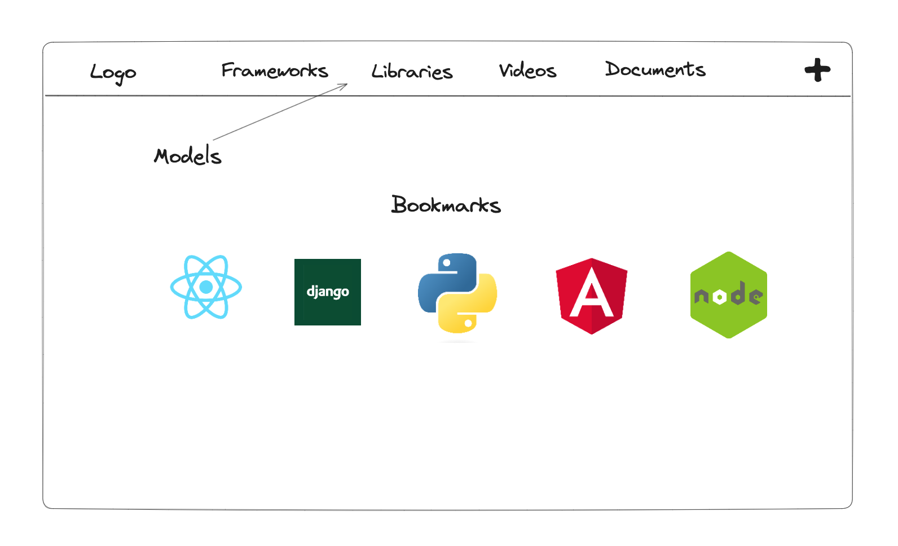
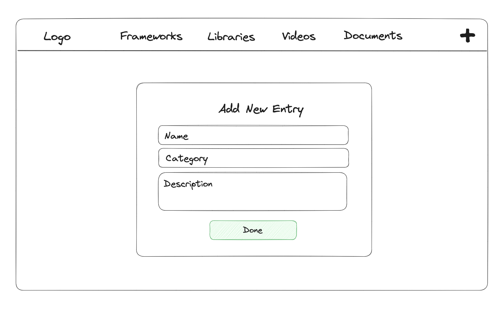

# BirdNest
- [Deployed Frontend](birdnest-frontend-1hgqs797q-yunapahk.vercel.app)
- [Deployed Backend](https://birdnest-backend-bc7d.onrender.com) 
- [Trello Board](https://trello.com/b/4JSumEwy/birdnest)

## Description
- Comfortable bird's nest for developers to for resources based on libraries, frameworks, videos, and documentation.

## UI Mock Up
_Dashboard_



_Create/Update_



## Endpoints
| Method | Route            | Description               |
|--------|------------------|---------------------------|
| GET    | /api/entries   | Retrieve all entries   |
| POST   | /api/entries      | Add a new entry         | 
| GET    | /api/entries/:id   | Retrieve a entry by ID    | 
| PUT    | /api/entries/:id   | Update a entry by ID      |
| DELETE | /api/entries/:id   | Delete a entry by ID      | 

## ERD 
```mermaid
erDiagram
    ENTRY ||--|{ CATEGORY : belongs_to
    CATEGORY {
        int id
        string name
    }
    ENTRY {
        int id
        string name
        string description
        int categoryId FK
    }

  


